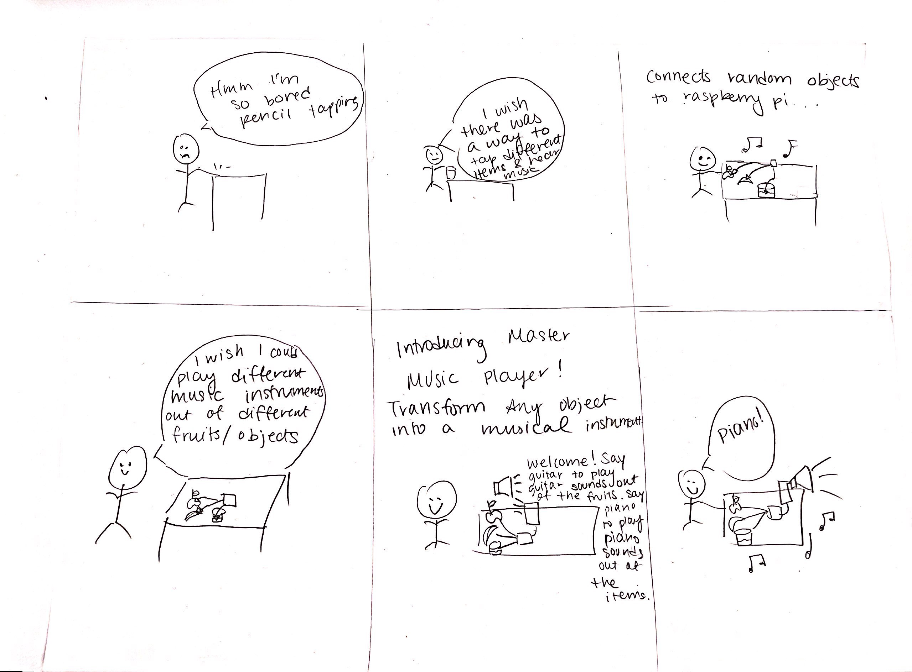
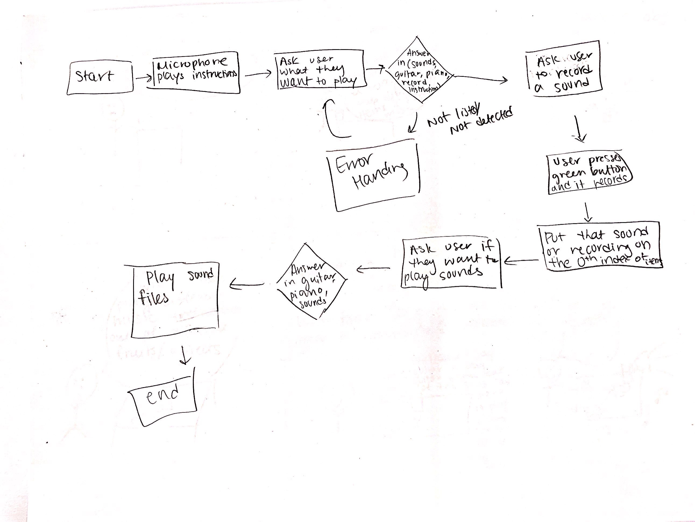
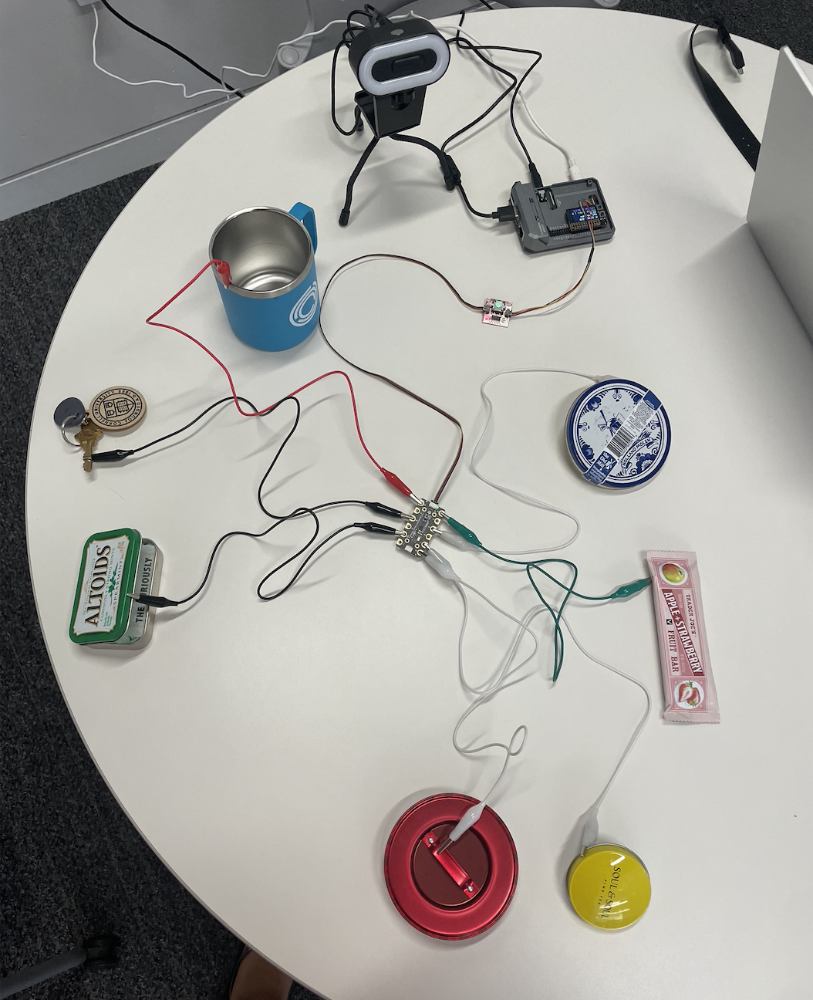
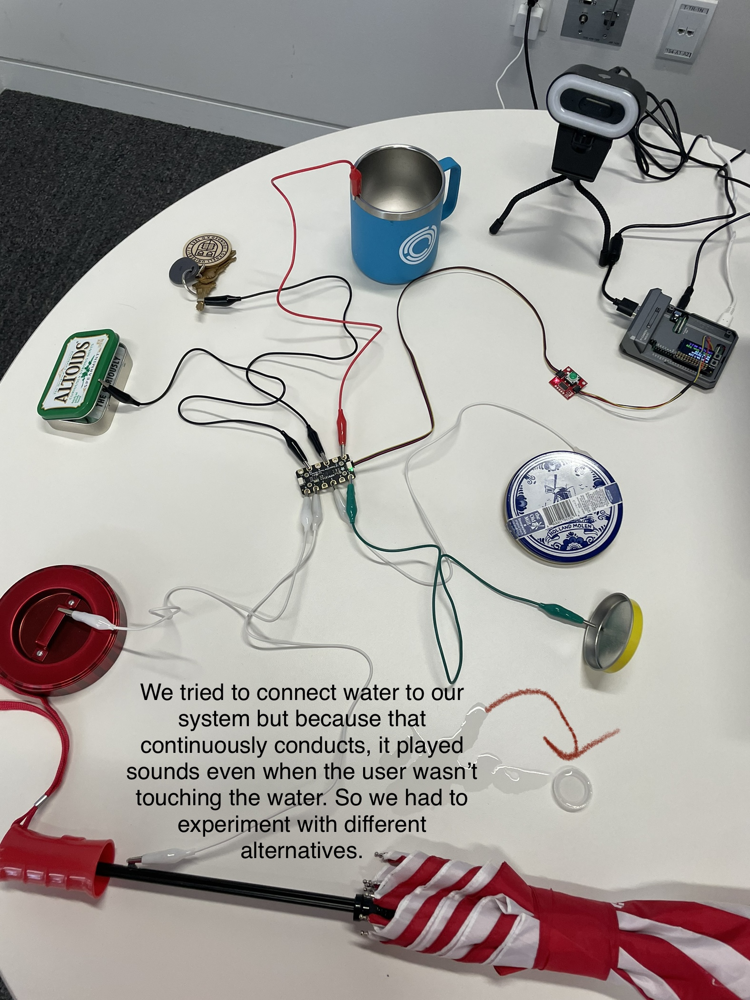

# Chatterboxes
**COLLABORATORS:** [Khushi Bhansali (NetID: kb737)](https://github.com/Khushibhansali/Interactive-Lab-Hub/tree/Fall2023/Lab%203)
[](https://www.youtube.com/embed/Q8FWzLMobx0?start=19)

In this lab, we want you to design interaction with a speech-enabled device--something that listens and talks to you. This device can do anything *but* control lights (since we already did that in Lab 1).  First, we want you first to storyboard what you imagine the conversational interaction to be like. Then, you will use wizarding techniques to elicit examples of what people might say, ask, or respond.  We then want you to use the examples collected from at least two other people to inform the redesign of the device.

We will focus on **audio** as the main modality for interaction to start; these general techniques can be extended to **video**, **haptics** or other interactive mechanisms in the second part of the Lab.

## Prep for Part 1: Get the Latest Content and Pick up Additional Parts 

### Pick up Web Camera If You Don't Have One

Students who have not already received a web camera will receive their [IMISES web cameras](https://www.amazon.com/Microphone-Speaker-Balance-Conference-Streaming/dp/B0B7B7SYSY/ref=sr_1_3?keywords=webcam%2Bwith%2Bmicrophone%2Band%2Bspeaker&qid=1663090960&s=electronics&sprefix=webcam%2Bwith%2Bmicrophone%2Band%2Bsp%2Celectronics%2C123&sr=1-3&th=1) on Thursday at the beginning of lab. If you cannot make it to class on Thursday, please contact the TAs to ensure you get your web camera. 

**Please note:** connect the webcam/speaker/microphone while the pi is *off*. 

### Get the Latest Content

As always, pull updates from the class Interactive-Lab-Hub to both your Pi and your own GitHub repo. There are 2 ways you can do so:

**\[recommended\]**Option 1: On the Pi, `cd` to your `Interactive-Lab-Hub`, pull the updates from upstream (class lab-hub) and push the updates back to your own GitHub repo. You will need the *personal access token* for this.

```
pi@ixe00:~$ cd Interactive-Lab-Hub
pi@ixe00:~/Interactive-Lab-Hub $ git pull upstream Fall2022
pi@ixe00:~/Interactive-Lab-Hub $ git add .
pi@ixe00:~/Interactive-Lab-Hub $ git commit -m "get lab3 updates"
pi@ixe00:~/Interactive-Lab-Hub $ git push
```

Option 2: On your own GitHub repo, [create pull request](https://github.com/FAR-Lab/Developing-and-Designing-Interactive-Devices/blob/2022Fall/readings/Submitting%20Labs.md) to get updates from the class Interactive-Lab-Hub. After you have latest updates online, go on your Pi, `cd` to your `Interactive-Lab-Hub` and use `git pull` to get updates from your own GitHub repo.

## Part 1.
### Setup 

*DO NOT* forget to work on your virtual environment! 

Run the setup script
```chmod u+x setup.sh && sudo ./setup.sh  ```

### Text to Speech 

In this part of lab, we are going to start peeking into the world of audio on your Pi! 

We will be using the microphone and speaker on your webcamera. In the directory is a folder called `speech-scripts` containing several shell scripts. `cd` to the folder and list out all the files by `ls`:

```
pi@ixe00:~/speech-scripts $ ls
Download        festival_demo.sh  GoogleTTS_demo.sh  pico2text_demo.sh
espeak_demo.sh  flite_demo.sh     lookdave.wav
```

You can run these shell files `.sh` by typing `./filename`, for example, typing `./espeak_demo.sh` and see what happens. Take some time to look at each script and see how it works. You can see a script by typing `cat filename`. For instance:

```
pi@ixe00:~/speech-scripts $ cat festival_demo.sh 
#from: https://elinux.org/RPi_Text_to_Speech_(Speech_Synthesis)#Festival_Text_to_Speech
```
You can test the commands by running
```
echo "Just what do you think you're doing, Dave?" | festival --tts
```

Now, you might wonder what exactly is a `.sh` file? 
Typically, a `.sh` file is a shell script which you can execute in a terminal. The example files we offer here are for you to figure out the ways to play with audio on your Pi!

You can also play audio files directly with `aplay filename`. Try typing `aplay lookdave.wav`.

\*\***Write your own shell file to use your favorite of these TTS engines to have your Pi greet you by name.**\*\*
(This shell file should be saved to your own repo for this lab.)

**This is completed in greet_William.sh. I have it say "Hi William, hope you're having a great day!."**
---
Bonus:
[Piper](https://github.com/rhasspy/piper) is another fast neural based text to speech package for raspberry pi which can be installed easily through python with:
```
pip install piper-tts
```
and used from the command line. Running the command below the first time will download the model, concurrent runs will be faster. 
```
echo 'Welcome to the world of speech synthesis!' | piper \
  --model en_US-lessac-medium \
  --output_file welcome.wav
```
Check the file that was created by running `aplay welcome.wav`. Many more languages are supported and audio can be streamed dirctly to an audio output, rather than into an file by:

```
echo 'This sentence is spoken first. This sentence is synthesized while the first sentence is spoken.' | \
  piper --model en_US-lessac-medium --output-raw | \
  aplay -r 22050 -f S16_LE -t raw -
```
  
### Speech to Text

Next setup speech to text. We are using a speech recognition engine, [Vosk](https://alphacephei.com/vosk/), which is made by researchers at Carnegie Mellon University. Vosk is amazing because it is an offline speech recognition engine; that is, all the processing for the speech recognition is happening onboard the Raspberry Pi. 
```
pip install vosk
pip install sounddevice
```

Test if vosk works by transcribing text:

```
vosk-transcriber -i recorded_mono.wav -o test.txt
```

You can use vosk with the microphone by running 
```
python test_microphone.py -m en
```

\*\***Write your own shell file that verbally asks for a numerical-based input (such as a phone number, zipcode, number of pets, etc.) and records the answer the respondent provides.**\*\*

**This is completed in numerical_input.sh. I have it ask how many pets I have and then it prints that to the screen.**


### Serving Pages

In Lab 1, we served a webpage with flask. In this lab, you may find it useful to serve a webpage for the controller on a remote device. Here is a simple example of a webserver.

```
pi@ixe00:~/Interactive-Lab-Hub/Lab 3 $ python server.py
 * Serving Flask app "server" (lazy loading)
 * Environment: production
   WARNING: This is a development server. Do not use it in a production deployment.
   Use a production WSGI server instead.
 * Debug mode: on
 * Running on http://0.0.0.0:5000/ (Press CTRL+C to quit)
 * Restarting with stat
 * Debugger is active!
 * Debugger PIN: 162-573-883
```
From a remote browser on the same network, check to make sure your webserver is working by going to `http://<YourPiIPAddress>:5000`. You should be able to see "Hello World" on the webpage.

### Storyboard

Storyboard and/or use a Verplank diagram to design a speech-enabled device. (Stuck? Make a device that talks for dogs. If that is too stupid, find an application that is better than that.) 

\*\***Post your storyboard and diagram here.**\*\*


\*\***Please describe and document your process.**\*\*
We came up with many ideas before deciding to create a 20 questions game. We thought of making a pitch voice assistant for singers however that would require some AI since we would have to give feedback on pitch, duration, stability in voice etc. We then pivoted to a magic 8 ball assistant. Here the assistant give a magic oracle feeling to the user. The user could ask any question about their future and then the magic 8 ball tries to predict what happens. We thought this game would be too simple. Then we finally decided to make a 20 questions game and put a spin to it. Normally, the computer has to guess what the user is thinking of in 20 questions. We changed the game so that the user must guess what the computer is thinking of in 20 questions. 

In order to determine if the user is going in the correct direction of guessing the object we mapped out some potential questions/dialogue: 
- Is it a kitchen appliance?
- Does it have a heating element?
- Is it used for cooking?
- Is it used for cleaning?
- Does it need water?
- Does it have a digital display?
- Does it have a timer?
- Is it powered by electricity?
- Does it have moving parts?
- Is it used for food storage?
- Is it used for cooling?
- Is it found in the laundry room?
- Does it make noise when in use?
- Is it typically plugged into a wall outlet?
- Is it used for personal grooming?
- Is it used for entertainment?
- Is it small and portable?
- Does it have buttons or controls?

All these questions were then polled for common attributes. Those attributes are then going to be the key words that help us determine whether the user is getting closer or farther away from the object the computer has selected. For example, some attributes are electricity, heating_element, cooking, and cleaning. 

### Acting out the dialogue

Find a partner, and *without sharing the script with your partner* try out the dialogue you've designed, where you (as the device designer) act as the device you are designing.  Please record this interaction (for example, using Zoom's record feature).


Video Link to 20 Questions Interaction: https://drive.google.com/file/d/18or8bsbefnD0qtyv1swlcrn-wtqBNrtD/view

#### **Transcript**

**Computer**: Hello, welcome to 20 questions! In this game, I will choose a household appliance and you have to ask yes and no questions to guess it. Are you ready to play?

**User**: Awesome, let's play!

**Computer**: All right, ask a question.

**User**: Does the household appliance have dials?

**Computer**: Yes.

**User**: Hmm, does it have a heating element? 

**Computer**: Yes. 

**User**: Is it wider than a computer? 

**Computer**: Yes.

**User**: Hmm, is it a stove?

**Computer**: Congratulations, you win. 


\*\***Describe if the dialogue seemed different than what you imagined when it was acted out, and how.**\*\*
We imagined the user would take longer to guess the household appliance. We assumed the user would not ask yes or no questions. When we were recording we realized that we don't allow the user to ask clarifying questions before the game begins (we will address this in our code so that the user is able to ask questions regarding the rules of the game). The computer forgot to keep track of the number of questions the user was on. Additionally, after reflecting on the interaction, we realized we need to incorporate the following edge-case scenarios into our game's logic:
- User with a strong accent where the computer might misinterpret the user's words for a different word.
- User asking a question that the computer was not prepared for (keyword not in hard-coded code list).
- Audio from the user is inaudible / too low and/or poor quality.

### Prototyping the 20 Questions game on the Raspberry Pi

https://github.com/wjr83/Interactive-Lab-Hub/assets/143034234/f46bc6e4-ab55-430f-878c-74a3df02b001

**Things that worked well during the implementation of the 20 Questions game:**
- Using the GoogleTTS with predefined text for the Raspberry Pi to speak worked well.
- It was straightforward to build just a few .sh files as speaking templates and pass in arguments to these .sh files from a Python script to emulate the voice of the computer/controller of the game.

**Things that don't work as well:**
- Speech processing in Vosk has a significant delay. This made it very challenging to get the timing right for the 20 Questions game. 
- Speech recognition in Vosk has a lot of errors, which made processing the recognized text rather challenging.
- A lot of times only parts of the audio emitted by the user were recognized, and there was no clear way implemented yet to attempt a second time the same question (this was fixed on a later iteration). 
  

### Wizarding with the Pi (optional)
In the [demo directory](./demo), you will find an example Wizard of Oz project. In that project, you can see how audio and sensor data is streamed from the Pi to a wizard controller that runs in the browser.  You may use this demo code as a template. By running the `app.py` script, you can see how audio and sensor data (Adafruit MPU-6050 6-DoF Accel and Gyro Sensor) is streamed from the Pi to a wizard controller that runs in the browser `http://<YouPiIPAddress>:5000`. You can control what the system says from the controller as well!

\*\***Describe if the dialogue seemed different than what you imagined, or when acted out, when it was wizarded, and how.**\*\*

# Lab 3 Part 2

For Part 2, you will redesign the interaction with the speech-enabled device using the data collected, as well as feedback from part 1.

## Prep for Part 2

1. What are concrete things that could use improvement in the design of your device? For example: wording, timing, anticipation of misunderstandings...
   
 We could improve the complexity of our game. Currently, we instruct the computer to select a household appliance and then have the user guess what the computer is thinking of. But in doing so, the user was almost always able to guess it and did not need 20 questions to complete the game. Another area of improvement is that we assumed the user would not ask yes or no questions. When we were recording we realized that we don't allow the user to ask clarifying questions before the game begins (we will address this in our code so that the user is able to ask questions regarding the rules of the game). The computer forgot to keep track of the number of questions the user was on. Additionally, after reflecting on the interaction, we realized we needed to incorporate the following edge-case scenarios into our game's logic. First, a user with a strong accent where the computer might misinterpret the user's words for a different word. Second, the user who asks a question that the computer was not prepared for (keyword not in hard-coded code list). Last, if the audio from the user is inaudible / too low and/or poor quality.
  
3. What are other modes of interaction _beyond speech_ that you might also use to clarify how to interact?

We could've used other sensors like a green light for example to indicate that the user guessed correctly. We could also then display a red light if the user guessed incorrectly. We could also have a visual display of instructions so that the user knows exactly how the game works instead of relying on the microphone.
   
5. Make a new storyboard, diagram, and/or script based on these reflections.


## Prototype your system

The system should:
* use the Raspberry Pi 
* use one or more sensors
* require participants to speak to it.

### Install Dependencies for Sensors:
In order to get the Sparkfun Qwiic Green Button working, the instructions on the following GitHub pages must be followed to install the necessary dependencies:
- https://github.com/sparkfun/Qwiic_Button_Py
- https://github.com/sparkfun/Qwiic_Py
- https://github.com/sparkfun/Qwiic_I2C_Py

For the capacitive touch sensor to work, install the following package through pip:
- ```pip install adafruit-circuitpython-mpr121```

Additionally, run the following command on the shell file describe below:
- ```chmod +x music_player.sh```

### Credit to the Sources of the Musical Notes Used in this Project
- https://mixkit.co/free-sound-effects/music/
- https://www.ee.columbia.edu/~dpwe/sounds/instruments/
- https://www.soundsnap.com/search/audio?query=note
- https://zenodo.org/record/3685367

*Document how the system works*


*Include videos or screencaptures of both the system and the controller.*

We've incorporated 3 sensors for this assignment. The main component is the voice interaction which guides the user in playing instructions, playing sounds, and recording user-generated sounds. The second sensor we used was a button. We programmed the button to start recording user-generated sounds from the microphone. The 3rd sensor we used was a touch sensor. We plugged random objects like an aluminum wrapper for a granola bar, a mug, an Altoids box, a tin lid, an umbrella, and more onto the touch sensor. We downloaded rapper beats and guitar sounds as WAV files and programmed them onto specific ports on the touch sensor. Then the individual objects were mapped to those ports. We also allowed the user to play their recorded file using the 1st port on the touch sensor.  


## Test the system
Try to get at least two people to interact with your system. (Ideally, you would inform them that there is a wizard _after_ the interaction, but we recognize that can be hard.)

> - **Test 1:** https://drive.google.com/file/d/16SrwlbJvglBM9fTPEG8mVKpvt0pfzus9/view?usp=sharing

> - **Test 2:** https://drive.google.com/file/d/1T2vmu2gTri7jIbcxwpTxcQ-09_eFSmLU/view?usp=sharing

> - **Test 3 (explanation of Music Player logic by the developers of the interactive device):** https://drive.google.com/file/d/17zaYvy2DhSgsytYhwVt7JZ_tkFLlfvl8/view?usp=drive_link


Answer the following:

### What worked well about the system and what didn't?

The system excelled in transforming a diverse array of objects into musical instruments, showcasing versatility in creating unique auditory experiences. The integration of random objects furthered the ingenuity of our system. We had successfully programmed recording the user from the microphone, playing sounds from the touch sensor, and allowing the user to make a song by playing multiple sounds simultaneously (which is demonstrated in test 2). 

However, certain limitations surfaced during the interaction. Our initial setup included using water as a random item you could touch and a sound would play. However, after some user testing, we found out that water continuously conducts electricity so it would be playing sounds even when the user didn't touch it. 
Here's a picture of the initial setup:



Here's a video of why that was a problem: https://drive.google.com/file/d/1sZiTmi3b8QzF2jGA98JnZuCitEs0bo9X/view?usp=sharing

Another problem we faced, which was demonstrated in test 2 was that the microphone was not good at understanding people with accents. It had a really hard time picking up user instructions even though the user was loud, audible, and close to the microphone. Additionally, in one of our tests, a user said a keyword that we hadn't programmed so we had to stop filming and instruct them on what keywords control the system instead of having error handling. In all, we weren't able to handle these edge cases and errors in these time constraints, making the system not reach its potential.  

### What worked well about the controller and what didn't?

It was great how many options of sounds the user had. The user could swap any objects connected to the touch sensor. If we had more time we would've connected so many different objects to the touch sensors to see what the output would be. For example, scissors, umbrella rod, copper-taped items, granola aluminum wrappers, jewelry, paperclips, and water. 

What didn't work well was the microphone's voice capture. We wanted to make the instructions appear in numerical order to the user. But the microphone never understood four and instead kept hearing for. So when we changed that system to keyword-controlled actions, it was smoother. However, when asking the microphone to repeat instructions it tends to mess up and play the instructions three times because it thinks the user said the keyword for it, three times even when they didn't. 

### What lessons can you take away from the WoZ interactions for designing a more autonomous version of the system?

In analyzing the Wizard of Oz interactions for our music player project on the Raspberry Pi, we observed that users responded positively to intuitive interactions for different musical effects. However, some challenges arose in accurately translating certain object interactions into desired musical outcomes. To design a more autonomous version, we need to focus on refining the gesture recognition algorithm and incorporating user feedback for improved responsiveness to enhance the system's ability to adapt to diverse user interactions with various objects. 

### How could you use your system to create a dataset of interaction? What other sensing modalities would make sense to capture?

To create a dataset of interactions using our music player system, we can implement data-logging mechanisms that record user-generated sounds, object interactions, and corresponding musical responses. This dataset could include information about the type of object, the specific gestures employed, and the resulting musical output. Additionally, incorporating sensors such as accelerometers, gyroscopes, and touch sensors could provide valuable data on the dynamics of object manipulation. Integrating audio sensors to capture ambient sounds during interactions would offer context, and incorporating computer vision for recognizing object types and user gestures could enhance the dataset's richness. 
