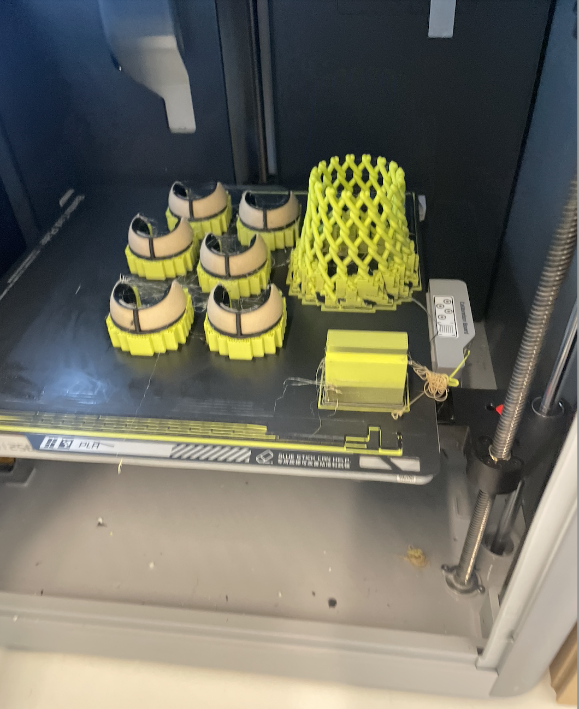
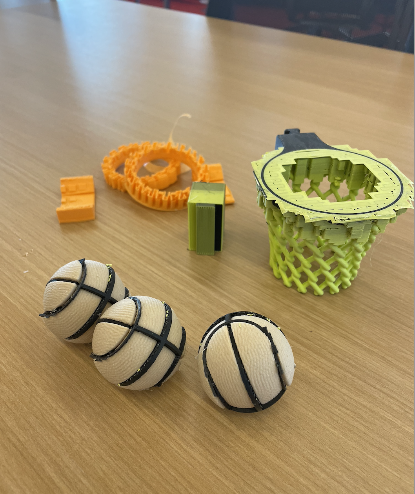
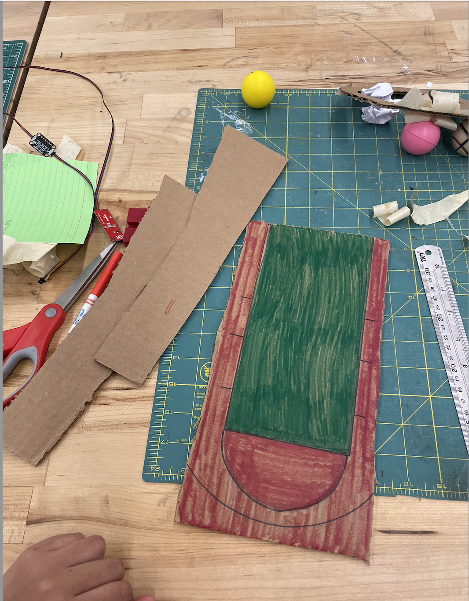
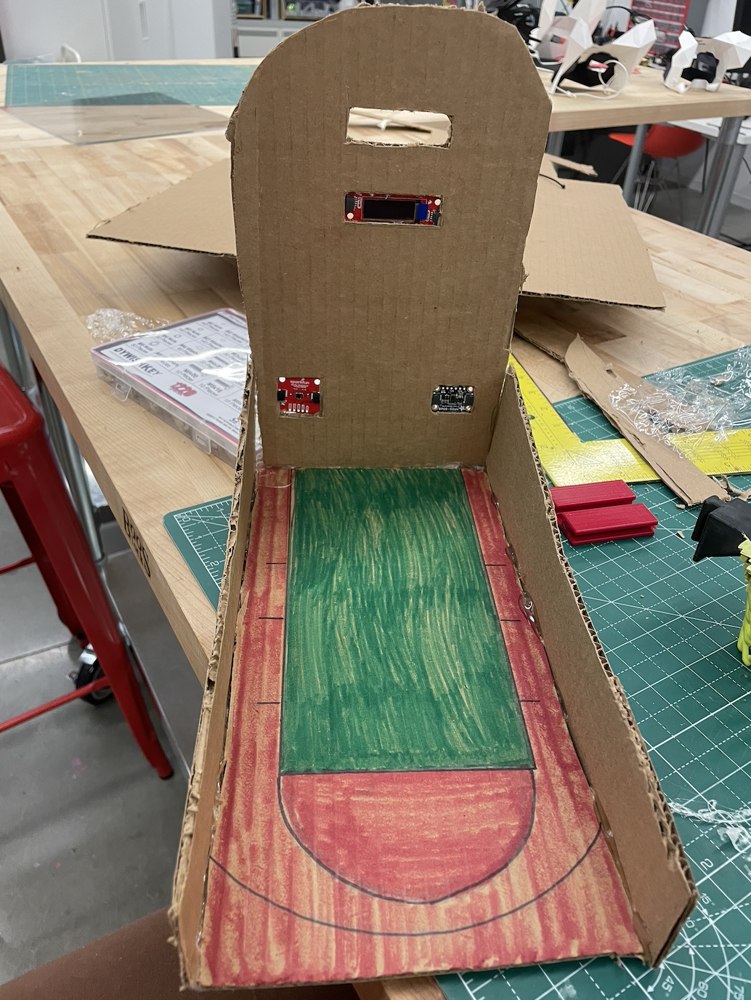
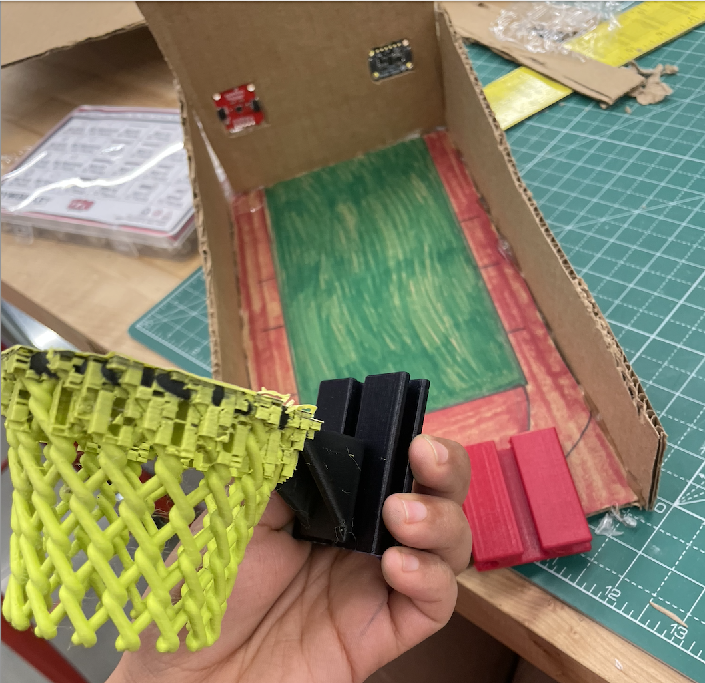
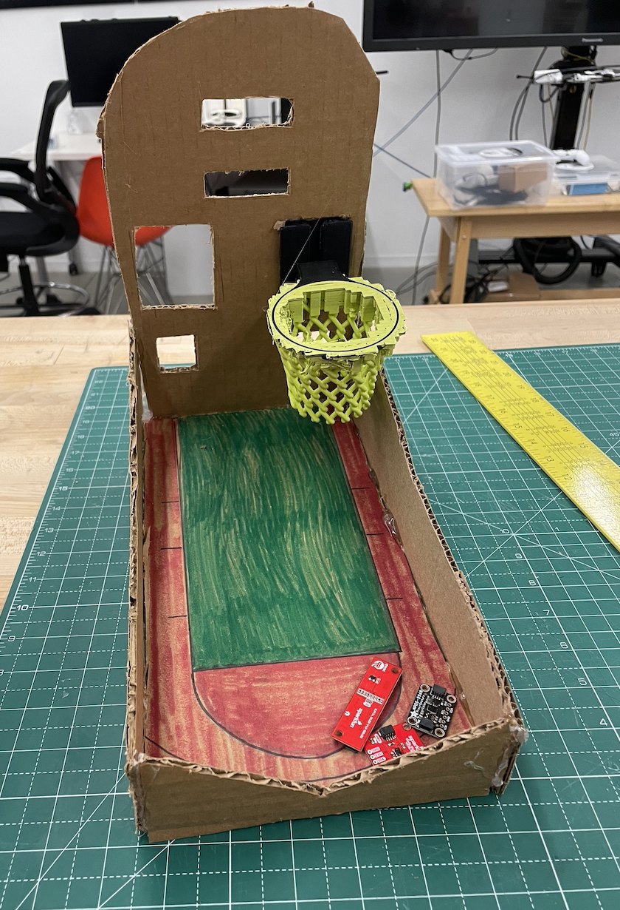
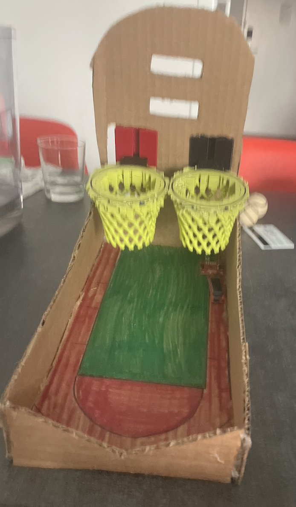

# Ph-UI!!!

**COLLABORATORS:** [Khushi Bhansali (NetID: kb737)](https://github.com/Khushibhansali/Interactive-Lab-Hub/tree/Fall2023/Lab%204), [Annetta Zheng (NetID: jz2272)](https://github.com/annetta-zheng/Interactive-Lab-Hub/tree/Fall2023/Lab%204)

## Lab Overview

C) [Paper Display](#part-c)

D) [Materiality](#part-d)

E) [Servo Control](#part-e)

F) [Camera Test](#part-f)

G) [Record the interaction](#part-g)

### Part C
### Physical considerations for sensing

**\*\*\*Draw 5 sketches of different ways you might use your sensor, and how the larger device needs to be shaped in order to make the sensor useful.\*\*\***

9 total ideas are described below. Sketches were drawn for 5 of the ideas whose primary sensor was the capacitive sensor.

1.	**Musical painting** (main sensor: Capacitive Touch Sensor) 
>* A canvas will be painted to create an interactive painting experience whereby touching specific parts of the canvas results in sounds being played through the camera’s speaker (these sounds are mapped using the capacitive touch sensor). 

2.	**A Halloween Display** (main sensor: OLED Screen)
>*  For example, a display of different scary exhibits on the OLED screen such as:
>>* Pet the spider and its legs fly at the user in doing so
>>* A pumpkin that laughs at the user if he/she presses green LED button or scares if the user presses the red LED button
3.	**Garage Band or Guitar Hero type musical game** (main sensor: Capacitive Touch Sensor) 
>* There are four or more colored objects the user has to touch or step on (barefoot for conductivity to work with the capacitive touch sensor). The user is told which items to touch on the OLED screen (the color of object is displayed) and for how long.

4.	**Game: Twister Box!** (main sensor: Capacitive Touch Sensor) 
>* Raspberry Pi sits inside a box with conductive stickers (or perhaps the entire side of the box is conductive, each side mapping to some feature or action). The OLED screen tells the user which color to touch (the color of object is displayed) and for how long. The objective of the game is to touch all the colors prompted by the computer in the least amount of time possible. The device will keep a record of high scores. The ID for the high scores can be inputted with the keypad (date of birth), a button to enable speech recognition to convert a name spoken to the name of the player, and an actual keyboard to input the player’s name. 

5.	**Game: Color Mixing!** (main sensor: Capacitive Touch Sensor) 
>* A variation of the game above (perhaps a more challenging approach) would be to press the two colors (using the subtractive color model) that when mixed (e.g., such as when mixing paint) make the color displayed on the screen. This would be a fun game to teach young kids the basics of color theory for an introductory art class.
> 
 

> 
 

6.	**A Piano with 12 Keys** (main sensor: Capacitive Touch Sensor) 
>* Have the functionality to record the music generated (using the green or red button to start and stop the recording through the camera’s microphone). The OLED screen can display the notes to play (if practicing a specific song). Note: This would be most feasible for four-chord songs. 

7.	**Game: Crack the Cipher to Unlock the Box!** (main sensor: Capacitive Touch Sensor, green and red LED buttons) 
>* The player must solve a series of puzzles in order to progress to the next level. The puzzles will range from easy to hard, and they will increase in difficulty the higher the level reached. A broad range of skills will be utilized in solving these puzzles, including technology, math, music, science, language, history, current news, etc. The OLED screen will provide the riddle to solve. Hints will be provided (a maximum of 3 hints per level). The inspiration for this game came from the Escape Room team-building game.
8.	**Math Speed Game:** (main sensor: Capacitive Touch Sensor) 
>*  Prompts are shown on the OLED Screen (multiplication, division, square root, exponents, binary numbers that need a decimal conversion, etc.) one at a time and the user needs to provide the answer through a keypad (which could be a lead-drawn keypad or object-inspired keypad using the capacitive touch sensor). 
>* The prompts would be random. This means that a random number (or two random numbers depending on the operation) would be generated and fed through a function to solve and check the answer provided by the player. 
>* The game will display a countdown (2 minutes) on the OLED screen (or miniPiTFT screen).
>* The objective of the game is to solve as many of the mathematical expressions as possible before the countdown reaches zero. 

9.	**Hoops on the Pi** (main sensors: Light/Proximity/Gesture sensor and Distance Sensor, coupled with speakers, and green and red LED buttons) 
>*  Use the distance sensor and proximity sensor to detect if an object (ball) has made it through the basket/hoop. 
>>*  This avoids us having to be connected to the ball (e.g., through a conductive string) as would be the case if this were being done with the capacitive touch sensor.
>* Multiplayer game (maximum of two players, unless Khushi and William can combine their sensors on the same bus – then it is a maximum of four players assuming we can differentiate between two identical sensors on the bus).

>* **Version A of the Hoops Game:**
>>*  Players take turns shooting at the same basket to play the game H-O-R-S-E. 
>>>*  H-O-R-S-E is a game played by two people on a basketball court. The idea of the game involves matching baskets. The player who makes shots that the opponent does not duplicate wins the game. Example: The second person shooting must duplicate the first-person's shot if it is made. If the second shooter misses, he/she receives the letter "H". If the first person's shot is missed, the second shooter may attempt any shot. If his/her shot is made, the opponent is obligated to duplicate it. Each time a shooter misses a shot that he/she attempted to duplicate, a letter is "awarded". The game continues until one person accumulates 5 letters or H-O-R-S-E.
>>*  The user tells the computer which player is throwing at any given time by pressing the green LED button (i.e., Player #1) or the red LED button (i.e., Player #2).
>>*  This version of the game is not timed. 
>*  **Version B of the Hoops Game:**
>>*  At the beginning of the game, one player will input the duration of their game (for the countdown that will be displayed).
>>*  Two players face each other on opposite sides of a tall, thin box where each of the two sides has its own basket/hoop. Alternatively, each player can face a cardboard wall that has two hoops positioned at the same height but with a horizontal distance between each other. The OLED screen will keep track of the number of points made by each player (or team, if two pairs are shooting into the same basket). 
>>>*  Or four players each face a side of a box, where each box has its own basket/hoop. Note: this is only possible if Khushi and I can combine both our Gesture Sensors and Distance Sensors on the same bus. This game can also be played with teams of two competing for a joint high score.
>>* Points will be displayed to each user player on the OLED screen.
>>*The miniPiTFT screen will display a timer/countdown. The objective of the game is to score as many baskets as possible before the timer runs out. 
>* The camera’s speaker can be used to make a sound every time a basket/hoop is made. 
>>* Note: the basket/hoop would be shaped as a cone (so that it’s easier to make a basket) with an open top and bottom to allow the ping-pong ball to fall through.
>>* Current Idea: The sensor would be positioned flush with the bottom of the conical basket (needs to be tested).
>* The speaker will also indicate which player won.
>*	The game can be played with ping-pong balls (ideally), aluminum foil balls, paper balls, or any other object that fits through the cardboard hoop and won’t damage the structural components.

**\*\*\*What are some things these sketches raise as questions? What do you need to physically prototype to understand how to answer those questions?\*\*\***
* How big should the interactive device be? How portable should the interactive device be?
* Where should the sensors and Raspberry Pi be stored such that these are not visible to the user?
>* How will the Raspberry Pi be powered hidden in this context?
* Where should the screen be positioned?
* Where should the buttons be positioned?
* Is any insulation needed to ensure connections to the capacitive sensor don't touch other connections by mistake?
* How should the circuitry to the capacitive sensor be designed so as to minimize real estate and materials used?
* Which colors should be used for what task?
* How should the information on the small display be designed such that it maximizes readability?
* How fun or amusing will users find these interactive devices? How long will they want to play for?

We would need to physically prototype any inputs from the user, sensor connections, and proximity to the interactive device.

**\*\*\*Pick one of these designs to prototype.\*\*\***
1.	**Musical painting** was chosen for Part 1 of Lab 4.

### Part D
### Physical considerations for displaying information and housing parts

Label: Canvas with an OLED screen and copper tape

* Sketch #1: OLED Screen outside of canvas, next to the artist's name and description of the artwork. 

> 

* Sketch #2: OLED Screen centered on canvas, rotated 90 degrees (vertical orientation).

> 

* Sketch #3: OLED Screen outside of the canvas, centered below the canvas.

> 

* Sketch #4: OLED Screen on canvas, top left corner of the canvas.

> 

* Sketch #5: OLED Screen on canvas, bottom right corner of the canvas.

> 

**\*\*\*What are some things these sketches raise as questions? What do you need to physically prototype to understand how to answer those questions?\*\*\***
* What should be the primary interaction? The OLED Screen or the sounds emitted from the canvas?
>* Depending on the answer to the previous question, where should the OLED screen be positioned such that it does not subtract or distract from the immersive musical experience?
>>* At the same time, we would like the OLED screen to be noticed (even if it's deemed secondary in importance relative to the sounds). What would be the best way to achieve this?
>* How close to the canvas should users be to best appreciate the coupled interaction between the OLED screen, painting, and sounds emitted from the canvas?
>* The OLED Screen's electric circuitry should not cause the canvas to emit sounds (the OLED screen needs to be properly insulated from the conductive paint that's connected to the capacitive sensor).
>* How would a new user know to touch the canvas?
We would need to physically prototype the interaction with new users (50% with / 50% without telling them instructions of how the art piece works), paying attention to the distance users maintain from the interactive device and if they notice the OLED screen (after how much time do they notice the OLED screen, is it ignored shortly after, etc.).

**\*\*\*Pick one of these display designs to integrate into your prototype.\*\*\***
* Sketch #3 was chosen (OLED Screen outside of the canvas, centered below the canvas).

**\*\*\*Explain the rationale for the design.\*\*\*** (e.g. Does it need to be a certain size or form or need to be able to be seen from a certain distance?)
* Sketch #3 was chosen (OLED Screen outside of the canvas, centered below the canvas) because it provided the closest proximity of the OLED screen to the canvas without blocking any of the painted artwork. Additionally, having the OLED screen on the canvas required more complexity to properly insulate the back of the OLED Screen so that the OLED screen does not activate any of the sensors on the capacitive sensor through the conductive paint on the canvas. The art piece will be displayed in a gallery along with other paintings. When visiting museums and art galleries, Khushi and William agreed that most visitors look at the art piece first, and only a few stop to read the artist's name and description of the piece (which is why "Sketch #1" was **not** chosen to prototype). 

Build a cardboard prototype of your design.

**\*\*\*Document your rough prototype.\*\*\***
> Explanation of how the canvas was built:
>* https://drive.google.com/file/d/1BsVfzuWh_NoRWDA-dklnQ7_ReMfcErx3/view?usp=sharing

Work in Progress: 

> https://github.com/wjr83/Interactive-Lab-Hub/assets/143034234/b6ee3583-9b68-4e4e-b652-fac1c0158c52

> https://github.com/wjr83/Interactive-Lab-Hub/assets/143034234/e4afe588-acd1-4dbe-8542-afc698f1d670

> https://github.com/wjr83/Interactive-Lab-Hub/assets/143034234/8510b69e-f023-466b-a832-77fe28af47d3

> https://github.com/wjr83/Interactive-Lab-Hub/assets/143034234/98188df9-7155-4f9c-8754-294a0231ea78

> https://github.com/wjr83/Interactive-Lab-Hub/assets/143034234/742fa614-d0a6-4fbf-9ffd-8219caba780c

> Final Working Prototype:
>* https://drive.google.com/file/d/1IGTGFBhhlMhjE33mpCJneUV5W9Ue77PH/view?usp=sharing

LAB PART 2

### Part 2

**Looks like:**
**We started out with this [initial prototype](https://drive.google.com/file/d/1oaXo3QvoKQwaQ03WDGpz5IlhfeEvjE5C/view?usp=sharing)**

However, we immediately ran into physical errors where the hoop wasn't able to stand up. So we created a funnel that would not only support the hoop but also guide the ball. This ended up not working though since the ball would get stuck in the funnel. 

So we redid the entire design by designing 3D-printed hoops.

 

That ended up making this. 

 

 

We then redid the basketball hoop's physical interface. 

 

Here are some pictures of us building a portable, basketball court. 

 

 

 

This was our final product. 

 

In this prototype, we are using an OLED screen to display game instructions and show the user a live point display, and a modifiable timer. We are also using an LED stick for 2 games to indicate whose turn it is. We use a rotary encoder by turning it to pick different games to play from the OLED screen display. We use the proximity sensor and the distance sensor on each hoop to measure whether a ball has made it through the hoop.  

**Here's a recording of our [final interaction](https://drive.google.com/file/d/1Ph0qyhnytpZ1bpy8CmlznIPA5ZA2bH7j/view?usp=sharing)**
