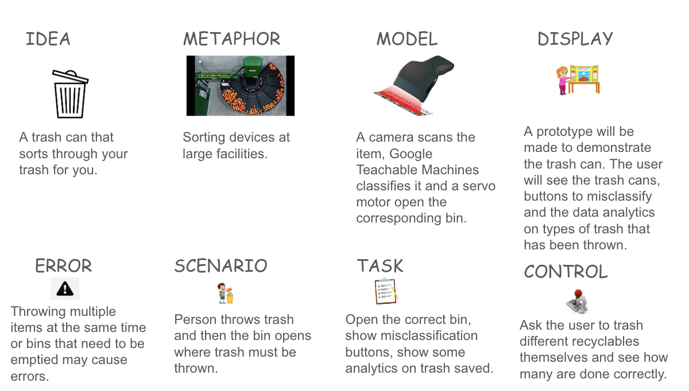
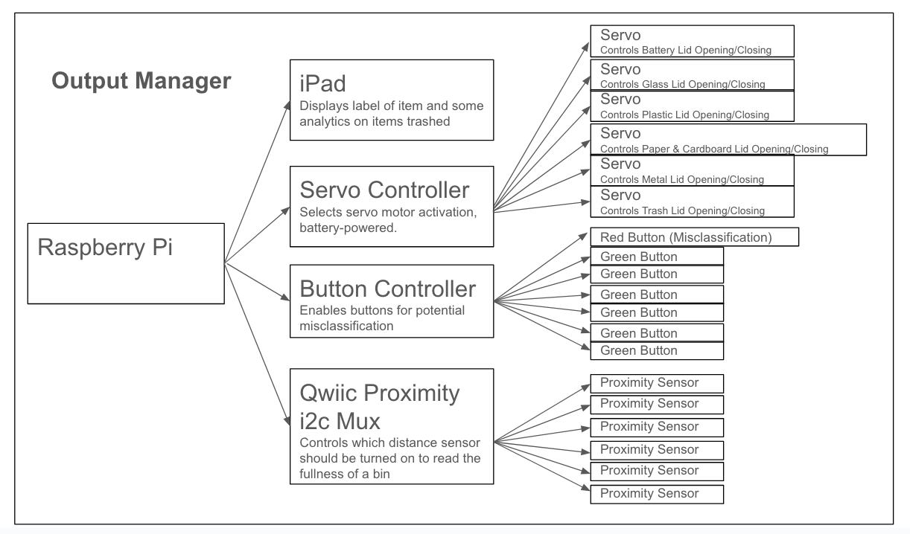
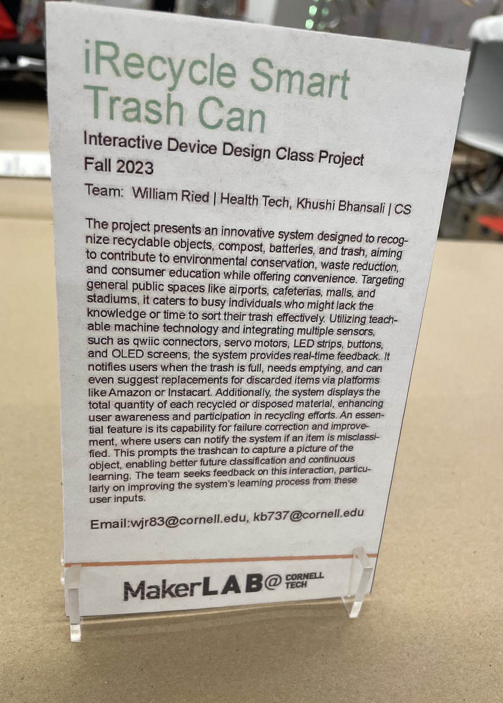
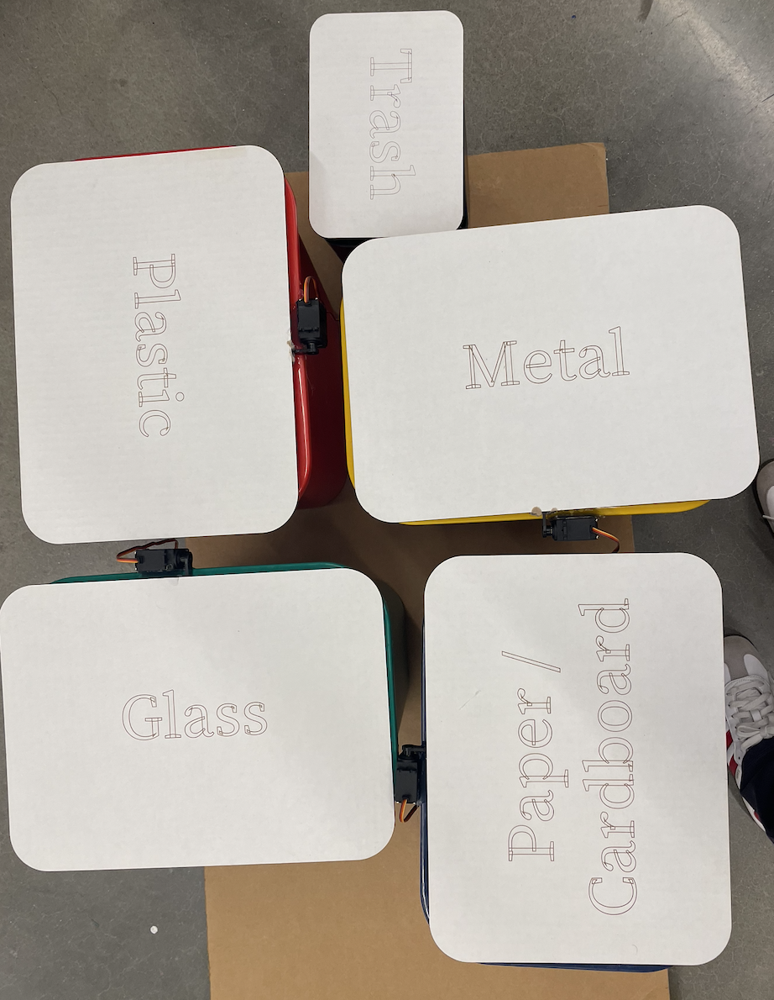

# Final Project: iRecycle

## Project Plan
Using the tools and techniques learned in this class, design, prototype, and test an interactive device that can distinguish between recyclable objects (paper, cardboard, plastic, glass, metal), trash, and batteries. 

#### COLLABORATOR: [Khushi Bhansali (ID: kb737)](https://github.com/Khushibhansali/Interactive-Lab-Hub/tree/Fall2023/Smart-Trash-Can)

### Big Idea & Motivation for Project & Objective
- A system to recognize recyclable objects from non-recyclable objects is motivated by several factors:

> - Environmental Conservation: Effective waste separation and recycling play a crucial role in reducing the environmental impact of waste disposal. It helps conserve resources, reduce energy consumption, and lower greenhouse gas emissions.
> - Waste Reduction: Proper recycling minimizes the volume of waste sent to landfills or incinerators, leading to a reduction in the need for landfill space and decreased pollution from incineration.
> - Consumer Education: Confusion among individuals about the correct sorting of waste is a common issue. This system can serve as an educational tool, clarifying recycling guidelines and encouraging responsible disposal practices.
> - Convenience: Many consumers find it challenging to decipher complex instructions or symbols on bins. A machine learning solution simplifies the process by instantly classifying waste items through images, making it more user-friendly.

#### Intended Operation
- The system identifies an object and classifies it as one of the 5 recycled materials (paper, cardboard, glass, plastic, and metal), compost, hazardous materials requiring special handling (e.g., batteries), or otherwise as trash.
> - Primary Goal: Design a system capable of identifying recyclable objects (paper, cardboard, plastic, glass, and metal), compost, items requiring special handling (e.g., batteries), and trash.
> - Secondary Goal: Deployment of the system increases the number of items recycled, and decreases the incidence of non-recyclable objects being mixed with recyclable items in the recycling bin due to misinformation about what items can and cannot be recycled.
> - Tertiary Goal: Educate the general public on what items can be recycled and which ones cannot.

Project plan - November 14

### Parts Needed

The Device:

- 1x [Raspberry Pi 4 Model B Board](https://www.amazon.com/dp/B0899VXM8F?psc=1&ref=ppx_yo2ov_dt_b_product_details)
- 1x [32GB MicroSD Cards w/ Card Reader](https://www.amazon.com/SanDisk-SDSQUAR-032G-GN6MA-Samsung-Everything-Stromboli/dp/B0796Y6177/ref=sr_1_3?crid=1GRBD63EDRPAP&keywords=32gb%2Bmicrosd%2Bcards%2Bwith%2F%2Bcard%2Breader&qid=1700809250&s=electronics&sprefix=32gb%2Bmicrosd%2Bcards%2Bw%2F%2Bcard%2Breader%2Celectronics%2C151&sr=1-3&th=1)
- 1x [Adafruit Mini PiTFT - 135x240 Color TFT Add-on for Raspberry Pi](https://www.adafruit.com/product/4393)
- 1x [GeeekPi Raspberry Pi GPIO Extension Board, Raspberry Pi 4 Expansion Board GPIO 1 to 4 for Raspberry Pi 4B / 3B+ / 3B with Screws](https://www.amazon.com/GeeekPi-Raspberry-Extension-Expansion-Screws/dp/B08C2XK25W?ref_=ast_sto_dp)
- 1x [SparkFun Qwiic LED Stick - APA102C](https://www.sparkfun.com/products/18354)
> - Note: The retired version of the [Qwiic LED Stick](https://www.sparkfun.com/products/retired/14783) is compatible with the Arduino but not the Raspberry Pi (no Python module for Raspberry Pi exists for this version)
- 1x [SparkFun Qwiic Button - Red LED](https://www.sparkfun.com/products/15932)
- 6x [SparkFun Qwiic Button - Green LED](https://www.sparkfun.com/products/16842)
- 1x [SparkFun Qwiic pHAT v2.0 for Raspberry Pi](https://www.sparkfun.com/products/15945)
- 1x [Adafruit 16-Channel PWM / Servo HAT for Raspberry Pi - Mini Kit](https://www.adafruit.com/product/2327)
- > - 1x [5V 4A (4000mA) switching power supply - UL Listed](https://www.adafruit.com/product/1466)
- 6x [SparkFun Proximity Sensor Breakout - 20cm, VCNL4040 (Qwiic)](https://www.sparkfun.com/products/15177)
- 1x [Acrimet Wastebasket Bin for Recycling, 6.75 Gallon/ 27 Quart/ 24 Liter (Made of Plastic) (Metal/Yellow, Paper/Blue, Glass/Green, Plastic/Red) (Set of 4)](https://www.amazon.com/dp/B01J5XXK1I)
- 1x [JEBUTU Overhead Camera Mount Desk Stand with 360° Adjustable Holding Arm, Flexible Phone Stand with 360° Ballhead and Phone Mount Holder, Boom Stand for Microphone, Video Light, Webcam, Cell Phone](https://www.amazon.com/dp/B09Q31YD2K?ref=ppx_pop_mob_ap_share&th=1)
- 2x [SparkFun QwiicBus Kit - Extend The Range of Your I2C Communication Bus RJ45 connectors Reach up to 100ft Includes 1x QwiicBus-MidPoint 2X QwiicBus-EndPoint 2X CAT 6 Cable-3ft No Soldering Required](https://www.amazon.com/dp/B098V2WHMH?ref=ppx_pop_mob_ap_share)
- 1x [Miuzei MG996R Servo Motor Metal Gear High Speed Torque Digital Servo for RC DIY Helicopter Car Boat Robot (Set of 6)](https://www.amazon.com/dp/B0BZ4NT2JC?ref=ppx_pop_mob_ap_share&th=1)
- 1x [30 Pcs 3-Pin Extension Cable Cord Male to Female Lead Wire Connectors for Servo Extension Connection Control Board Remote Control Parts - 5 Sizes](https://www.amazon.com/dp/B08BF4C6S2?ref=ppx_pop_mob_ap_share) 
- 1x [SparkFun Qwiic Mux Breakout - 8 Channel (TCA9548A)](https://www.sparkfun.com/products/16784)
> - Helpful troubleshooting guide: https://electronics.stackexchange.com/questions/585681/multiple-tca9548a-multiplexers-are-not-working-correctly-with-more-than-3-connec
> > - https://learn.sparkfun.com/tutorials/qwiic-mux-hookup-guide?_ga=2.40512486.592347460.1700772500-269332035.1698912388&_gl=1*1s9uhgb*_ga*MjY5MzMyMDM1LjE2OTg5MTIzODg.*_ga_T369JS7J9N*MTcwMDgwOTM1OS42LjEuMTcwMDgwOTU2NS42MC4wLjA.#p 
- Cardboard
- Camera with USB Connection
- Qwiic Cables
- Tape
- Glue

## Verplank Diagram

**Preliminary Brainstorming On How We Think Users Will Use The System:**
> * Users may not always be fully aware of the uncertainties in the system. They might assume that the system's classifications are always accurate, especially if it doesn't provide clear feedback about its confidence level. 
> * The impact of misclassification on users can vary. In some cases, misclassifying an item as recyclable when it's not could lead to contamination of recycling streams and added processing costs. Misclassifying an item as non-recyclable when it's recyclable might lead to missed recycling opportunities. For compostable materials, misclassification could affect organic waste diversion rates.
> How could we change our interactive system to address this?
> > * To address these concerns, the interactive system will:
> > > * Implement a confidence level indicator: The system could provide a confidence score along with its classification. This way, users are aware of how certain or uncertain the system is about its decision.
> > > * Offer clear instructions: If an item is challenging to classify, the system could guide the user, such as suggesting a specific bin but indicating that the user should double-check.
> > > * Collect user feedback: Allow users to report misclassifications or provide feedback, which can be used to improve the system's accuracy over time.

What can you use the recyclable material identification system for?

> * The recyclable material identification system can be used for efficiently identifying and sorting recyclable materials, hazardous materials requiring special handling (e.g., batteries), and landfill-bound waste, simplifying the waste disposal process.
> * It can serve as an educational tool, raising awareness about responsible waste management and encouraging proper recycling practices.
> * The system can contribute to environmental conservation by promoting recycling, reducing waste, and minimizing landfill usage.

What is a good environment for the recyclable material identification system?

> * The recyclable material identification system thrives in environments with well-lit and clear waste disposal areas, where the camera can capture high-quality images of waste items.
> * It performs well in settings with users who are receptive to using technology for waste sorting and are open to real-time guidance.
> * Collaborative environments where users can provide feedback to enhance the recyclable material identification system's accuracy are ideal.

What is a bad environment for the recyclable material identification system?

> * The recyclable material identification system may not perform well in dimly lit or obstructed areas, as these conditions can hinder the camera's image capture and classification accuracy.
> * Environments with resistance to technology adoption or where users prefer traditional waste sorting methods may not be suitable for the system.
> * Locations with a lack of maintenance or a history of neglecting system upkeep can be problematic for the recyclable material identification system's long-term reliability.

When will the recyclable material identification system break?

> * The recyclable material identification system is susceptible to malfunction or breakdown when exposed to extreme environmental conditions, such as extreme heat, heavy rain, or physical damage.
> * Regular wear and tear, including camera lens contamination and sensor degradation, can contribute to breakdown over time.
> * If the machine learning model used in the recyclable material identification system becomes outdated and no longer receives updates or refinements, it may become less effective.
> * In the event of loss of power or, if solar-powered, weather (rain or snow) preventing optimal charge of the system causing the system to turn off.

Other properties/behaviors of the recyclable material identification system:

> * The recyclable material identification system continuously learns and improves from user interactions and feedback. Every time a new item is scanned, the system saves an image of the item to memory and adds it to the machine learning model. Likewise, if the system misclassifies an item and the used prompts the system with the correct classification via the Qwiic LED Buttons, the system corrects the label of the item and adds it to memory to improve the performance of the system. All of this happens behind the scenes without the user knowing. 
> * It can provide real-time feedback to users, including guidance on which bin to use and potential disposal instructions.
> * The system promotes responsible waste management and environmental sustainability, aligning with the United Nations Sustainable Development Goal 12.

How does the recyclable material identification system feel?

> * The recyclable material identification system offers a user-friendly and efficient waste sorting experience, reducing the complexity of recycling and waste disposal.
> * It can make users feel empowered to contribute to environmental conservation and engage in responsible waste practices.
> * Users might feel confident in using the system, knowing it simplifies their role in sorting waste materials correctly.

Our system successfully identifies and classifies an object as one of the 5 recycled materials (paper, cardboard, glass, plastic, and metal), batteries, or otherwise as trash.

**Ideas prioritized to improve performance, design, and interaction.**
> * Increase training dataset. In particular, we needed to keep the following in mind as we acquired more data:
> > * Types of objects need to be representative of all types of objects in the class.
> > * Orientation and deformation of objects should not affect the classification if the dataset used for training is comprehensive.
> > * Lighting conditions greatly affected the performance of the system. For such reason, we attempted to control (and reduce) the amount of light in the scanning area by creating the iRecycle box. Additionally, for all item classes, samples were collected in all of the following light conditions:
> > > * Less than 2000K: dim, yellowish light, close to candlelight.
> > > * 2000K-3000K: warm light with hints of yellow.
> > > * 3100K-4500K: bright, neutral white light.
> > > * 4600K-6500K: bright blue-white light (daylight = approx. 5200K)
> > > * ​6500K and up: very bright, bluish light.
> > * We originally had a category for compost, but this was later removed due to hygiene and cleanliness (the scanning bed started to get dirty and needed to be replaced). 
> * The type of trash / recyclable objects will vary drastically depending on the location of the system. We may need to add location-specific data for training for the smart recycling system (e.g., add feedback loop with new sample data collected --> label new data --> retrain classification model with location-specific data --> aggregate new data from all location-specific acquisitions into the model --> release automatic update of the model in the physical smart recycling system). 
> * A lot of time was spent on improving the recognition of the background. In fact, a highly specific background target was designed in Adobe Photoshop  such that the background would not be confused with paper. 
> > 
> * Added a feature to count the number of items of each type recycled. The system would continue counting from where it left off even if the system lost power. 
> > 
> > * Displayed these counts to the user by category type in hopes of promoting the mindset: reduce, reuse, recycle. 
> * Simplify Interaction and Design (Future Design Iteration):
> > *  It would be ideal if the user would simply place the object on a flat surface, where the camera would determine the type of object, and once that is confirmed, the item would be disposed of automatically by the system.

Features to be implemented in a future iteration of this project:

> * Ability to classify an object that contains more than 1 type of material (glass, metal, plastic, paper).
> > * Semantic Segmentation: Employ more advanced computer vision techniques like semantic segmentation to precisely identify regions within an image that correspond to different waste materials. This level of granularity can improve classification accuracy.
> * Feature that informs the maintenance department which bin is full and needs to be emptied.

## Design Ideas

Preliminary System Design showing scanning bed and bins.
|              |              |
|--------------|--------------|
|  |  |

|              |              |
|--------------|--------------|
|  |  |

|              |              |
|--------------|--------------|
|  |  |

[Click Here to See first Prototype of Lid Lifting](https://drive.google.com/file/d/1C5cLnaxrB7FoaEP3kzPWC2qWNnNfgsSR/view?usp=sharing)

#### Sensors Design

### Work in Progress
#### Original System Logic (before implementation)

#### Major Design Challenges & Resolutions
- Using a single continuous servo to open access to bins arranged in a circle proved very difficult. Therefore, we resorted to using 1, 180-degree servo per bin used.
- Detecting the background with 100% accuracy was difficult. We resorted to designing a high-feature / specific background to resolve this (rather than a plain, black background from previous, suboptimal iterations of our design)
- Mitigating I / O Errors: As the number of sensors increased in the systems, we had to be much more careful in managing resources on the bus effectively such that the bus and buffers would not be spammed and cause the system to crash. 

### Physical Prototype
#### Classification Algorithm
Classes trained: paper, cardboard, plastic, glass, metal, trash, background
> Video of 1st Working Model --> Classes trained: paper, cardboard, plastic, glass, metal, trash, background

https://github.com/wjr83/Interactive-Lab-Hub/assets/143034234/1a22da79-34c1-447c-b6e4-dba596737b10

> Videos of 1st Working Model with LED Stick and Servos Integrated --> Classes trained: paper, cardboard, plastic, glass, metal, trash, background

> Links to Additional Videos:
> - https://drive.google.com/file/d/1xpXrHjJocF4GKEThj-ELTZfUBcCoxF5q/view?usp=sharing
> - https://drive.google.com/file/d/1u5IOfdlreLqH__jfYqqWnZNcfAI5ys2A/view?usp=sharing

https://github.com/wjr83/Interactive-Lab-Hub/assets/143034234/a25f285a-4d48-4d5e-a48b-be5314112139

#### Final Algorithm Architecture (Google's Teachable Machines):
Note: Item samples were collected over 30 days:

## Physical Device Prototype 
#### Initial Camera Stand (using shoe boxes and camera with integrated light)

|                      |                      |
|----------------------|----------------------|
|  |  |

|                      |                      |
|----------------------|----------------------|
|  |  |

|                      |                      |
|----------------------|----------------------|
|  |  |

#### Initial Proof of Concept First Trashcan with Lid & Servo

[Click Here to see first prototype of lid lifting](https://drive.google.com/file/d/1C5cLnaxrB7FoaEP3kzPWC2qWNnNfgsSR/view?usp=sharing)

## Cornell Tech Open Studio Demonstration in Maker Lab: Testing out code with motors for first time

[Click Here to see Cornell Tech Open Studio Demonstration in Maker Lab](https://drive.google.com/file/d/1i4RNBf1oDMCrO1Wy92NQy5Wi5kTPHf6M/view?usp=sharing)

### Laser Cut Bin Lids, Laser Cut Battery Bin, Attached Servo Motors using Hot Glue Gun

|                      |                      | 
|----------------------|----------------------|
|    |    |
|                      |                      | 
|----------------------|----------------------|
|   | |

[Click Here to see the layout of bins after servo motors were attached ](https://drive.google.com/file/d/1siAHD9bbQhIL69RhRsb9UMw3Av2_2XOL/view?usp=sharing)

### Videos of System Progression / Development Overtime:

https://github.com/wjr83/Interactive-Lab-Hub/assets/143034234/9402e2db-5966-41d3-a7ee-04e845cfbafd

https://github.com/wjr83/Interactive-Lab-Hub/assets/143034234/dd97780c-fdca-4bb6-b8be-0a526b275ca9

https://github.com/wjr83/Interactive-Lab-Hub/assets/143034234/0e3f9657-198c-4f4c-9a38-60c7b0add741

https://github.com/wjr83/Interactive-Lab-Hub/assets/143034234/cf309ff3-26b8-400f-b193-494464e5796b

https://github.com/wjr83/Interactive-Lab-Hub/assets/143034234/c47fa359-3f2a-4325-9000-fe6a2b742e6a

### Light-Controlled Environment for Object Scanning
Camera height was found to be optimal at 17.5 inches to account for tall objects such as wine bottles yet still discern/classify small objects well (such as batteries). All training images were collected at this height, and the final enclosing was designed to allow for the camera placement to be set at a height of 17.5 inches. 

|                      |                      | 
|----------------------|---------------------------------------------|
|  |  |

|                      |                      | 
|----------------------|----------------------|
|  |  |

|                      |                      | 
|----------------------|----------------------|
|  |  |

#### Misclassification Interface & Classification Progress Indicator

The first LED Button design used for testing and validating the misclassification code is shown below:

The final design of the Misclassification Interface & Classification Progress Indicator designed in Adobe Illustrator and Laser Cut:
|                      |                      | 
|---------------------------------------------|----------------------|
|  |  |

|                      |                      | 
|----------------------|----------------------|
|  |  |

## Final Project Presentation: The iRecycle System

Final System Set-up

### Description of System
#### Inform the User to Scan the Object:

- **Instructions on the iPad:** The user is guided through the process with instructions displayed on the iPad screen. They are directed to place an object on the scanning bed, aligning it with a bulls-eye target.

#### Scan Object:

- **Progress Displayed on LED Stick:** The system communicates the scanning progress using an LED Stick. This is a visual representation of the classification confidence of the model. Presumably, the LED Stick changes its state or color to indicate different stages of the scanning process.

#### Report Classification to User:

- **Consistent Classification for 10 Times:** When the model consistently outputs the same label for an object in ten consecutive scans, the object is classified into one of the predefined categories: paper, cardboard, plastic, metal, glass, battery, or trash.
- **Image Acquisition for Dataset Expansion:** An image of the object is automatically captured and saved to memory. This contributes to expanding the dataset for training the machine learning model.
- **Display Classification to User:** The classified label is displayed to the user, color-coded according to the corresponding bin color.
- **Report if any of the bins is full and needs to be emptied**: Distance sensors were placed in each bin and would report to the user if the bin was full. The maintenance department (using a 2nd Raspberry Pi and MQTT), would also get a notification of which bin needs replacement.

#### Bin Interaction:

- **Bin Opening:** The bin corresponding to the classified label opens automatically and remains open for 20 seconds.
- **User Feedback for Misclassification:** During this time, the user has the option to provide feedback in case of a misclassification. If the system misclassifies the object, the user can press the red button followed by the green button with the correct classification.
- **Correction Process:** Upon correction, the system updates the image in memory with the correct label. The bin corresponding to the misclassified label is closed, and the correct bin is opened.
- **Automatic Bin Lid Closure:** After 20 seconds, the bin's lid closes automatically.

#### Statistics Update:

- **Recycling Statistics Display:** The system updates and displays statistics on the number of items recycled per class on the screen. This provides users with information on their recycling habits and encourages environmentally friendly practices.

[Click Here to see final project video](https://drive.google.com/file/d/1sphreEEsGq0kaO2dEE1w3JUFqz_g5T50/view?usp=sharing)

## User Testing
[Click Here to see final project user test](https://drive.google.com/file/d/1gLK1bqc0Nupb3r_tI-tR8ZrS1cnVEamW/view?usp=sharing)

### Reflections
The project introduces an innovative system designed to revolutionize waste management by recognizing recyclable objects, compost, batteries, and general trash. This initiative aims to make a significant contribution to environmental conservation, reduce waste, and educate consumers, all while ensuring convenience. The primary focus is on public spaces such as airports, cafeterias, malls, and stadiums, targeting busy individuals who may lack the time or knowledge to effectively sort their trash.

#### Key Features:

- **Teachable Machine Technology:** The system employs advanced teachable machine technology, offering a dynamic and adaptable approach to object recognition and classification. This ensures that the system continuously evolves and improves its accuracy over time.

- **Multisensor Integration:** Integrating various sensors, including qwiic connectors, servo motors, LED strips, buttons, and OLED screens, the system provides real-time feedback to users. This comprehensive sensor integration allows for a holistic and interactive user experience.

- **User-Friendly Notifications:** The system notifies users when the trash receptacle is full and needs emptying. Moreover, it can suggest replacements for discarded items through popular platforms like Amazon or Instacart, enhancing user convenience and facilitating responsible disposal.

- **Quantitative User Feedback:** Beyond just notifications, the system displays the total quantity of each recycled or disposed material. This feature enhances user awareness, encouraging active participation in recycling efforts and fostering a sense of responsibility for environmental conservation.

- **Error Correction and Continuous Learning:** An essential aspect of the system is its ability to learn from errors. Users can notify the system if an item is misclassified, prompting the trashcan to capture an image of the object. This captured data contributes to better future classification, ensuring the system continually refines its recognition capabilities.

#### Lessons Learned:

The development process provided valuable insights into the integration of multiple sensors and how to effectively handle errors that may arise in such a connected ecosystem. Design considerations were meticulously evaluated throughout the ideation, prototyping, and construction phases. The chosen layout emphasizes ease of access and modularity, underscoring the importance of user-friendly design in promoting widespread adoption and usability. The iterative nature of the project underscored the commitment to continuous improvement and adaptability, crucial elements in creating a successful and sustainable technology solution.

## Future Improvements

- We hope to send text message notifications (rather than MQTT notifications) to building cleaning facilities to notify them when the bin is full.
- For single-family homes, we could add features where you have a copy of that item added to your Amazon shopping cart when you trash the original one.
- We would also want to improve the design of the camera scanning area and find ways to prevent lighting issues from preventing correct classification.
- Additionally, we want to create a conveyor-type system designed specifically to be implemented at a waste management facility to remove the need for manual sorting / correction of recyclable materials and trash.

## Team Member Contribution
**William Reid (wjr83):** Purchased all sensors and servos used in the system, purchased trash bins, designed and laser-cut the scanning areas for the iRecycle system, designed and laser-cut lids for each bin, designed & laser-cut the battery bin, soldered the LED Buttons uniquely to give each of the 7 LED buttons used a unique address on the bus, developed the code to scan the object, developed the code to report the classification to the user, developed the code to open the bins via servo control, developed the code for user feedback/misclassification/correction, developed code to display and keep track of items recycled and display such statistics to the user, designed background, target and statistics layout for iPad screen to show statistics on how much has been trashed and what the current label is of the item being trashed. Partially developed the code to read multiple distance sensor data for bin-fullness indication. Assembled physical prototype (wiring of sensors and servos, attachment of servos to bins and lids, assembled battery bin).

**Khushi Bhansali (kb737):** Programmed distance sensors to recognize when bin is full. Helped assemble the servo motors to the bins, and helped design the positioning of the bin and sensor locations. Videotaped the final working version. Helped with documentation. 

