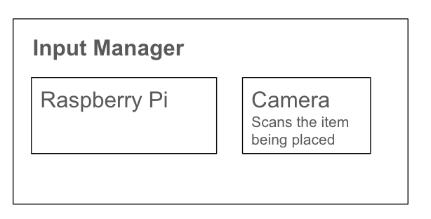
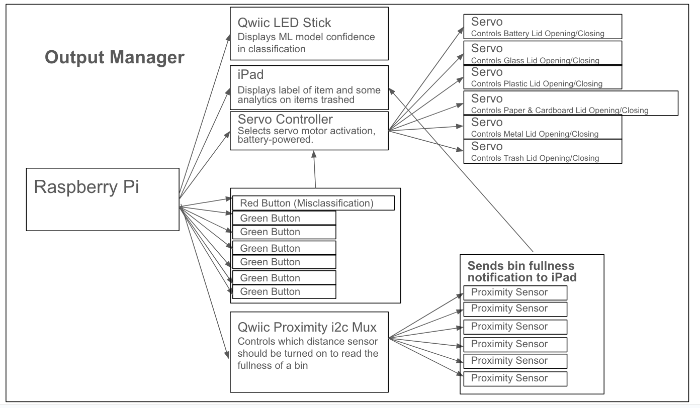

# Final Project: iRecycle

[Project Plan](#project-plan) 

[Functioning Project](#functioning-project) 

[Documentation of Design Process](#documentation-of-design-process) 

[Archive of All Code and Design Patterns](#archive-of-all-code-and-design-patterns) 

[Video Demo](#video-demo) 

[Reflections on Process](#reflections-on-process) 

[Group Work Distribution](#group-work-distribution) 

## Project Plan
Using the tools and techniques learned in this class, design, prototype, and test an interactive device that can distinguish between recyclable objects (paper, cardboard, plastic, glass, metal), trash, and batteries. 

#### COLLABORATOR: [Khushi Bhansali (ID: kb737)](https://github.com/Khushibhansali/Interactive-Lab-Hub/blob/Fall2023/FinalProject.md)

### Big Idea & Motivation for Project & Objective
- A system to recognize recyclable objects from non-recyclable objects is motivated by several factors:

> - Environmental Conservation: Effective waste separation and recycling play a crucial role in reducing the environmental impact of waste disposal. It helps conserve resources, reduce energy consumption, and lower greenhouse gas emissions.
> - Waste Reduction: Proper recycling minimizes the volume of waste sent to landfills or incinerators, leading to a reduction in the need for landfill space and decreased pollution from incineration.
> - Consumer Education: Confusion among individuals about the correct sorting of waste is a common issue. This system can serve as an educational tool, clarifying recycling guidelines and encouraging responsible disposal practices.
> - Convenience: Many consumers find it challenging to decipher complex instructions or symbols on bins. A machine learning solution simplifies the process by instantly classifying waste items through images, making it more user-friendly.

#### Intended Operation
- The system identifies an object and classifies it as one of the 5 recycled materials (paper, cardboard, glass, plastic, and metal), compost, special handling materials (e.g., batteries), or otherwise as trash.

> - Primary Goal: Design a system capable of identifying recyclable objects (paper, cardboard, plastic, glass, and metal), compost, items requiring special handling (e.g., batteries), and trash.
> - Secondary Goal: Deployment of the system increases the number of items recycled, and decreases the incidence of non-recyclable objects being mixed with recyclable items in the recycling bin due to misinformation about what items can and cannot be recycled.
> - Tertiary Goal: Educate the general public on what items can be recycled and which ones cannot.

Project plan - November 14

Peer feedback on Project plans: November 21

Functional check-off - November 28 & 30

Final Project Presentations - December 5 & 7

Write-up and documentation due - December 14

### Parts Needed

The Device:

- 1x [Raspberry Pi 4 Model B Board](https://www.amazon.com/dp/B0899VXM8F?psc=1&ref=ppx_yo2ov_dt_b_product_details)
- 1x [32GB MicroSD Cards w/ Card Reader](https://www.amazon.com/SanDisk-SDSQUAR-032G-GN6MA-Samsung-Everything-Stromboli/dp/B0796Y6177/ref=sr_1_3?crid=1GRBD63EDRPAP&keywords=32gb%2Bmicrosd%2Bcards%2Bwith%2F%2Bcard%2Breader&qid=1700809250&s=electronics&sprefix=32gb%2Bmicrosd%2Bcards%2Bw%2F%2Bcard%2Breader%2Celectronics%2C151&sr=1-3&th=1)
- 1x [Adafruit Mini PiTFT - 135x240 Color TFT Add-on for Raspberry Pi](https://www.adafruit.com/product/4393)
- 1x [GeeekPi Raspberry Pi GPIO Extension Board, Raspberry Pi 4 Expansion Board GPIO 1 to 4 for Raspberry Pi 4B / 3B+ / 3B with Screws](https://www.amazon.com/GeeekPi-Raspberry-Extension-Expansion-Screws/dp/B08C2XK25W?ref_=ast_sto_dp)
- 1x [SparkFun Qwiic LED Stick - APA102C](https://www.sparkfun.com/products/18354)
> - Note: The retired version of the [Qwiic LED Stick](https://www.sparkfun.com/products/retired/14783) is compatible with the Arduino but not the Raspberry Pi (no Python module for Raspberry Pi exists for this version)
- #x [SparkFun Qwiic Button - Red LED](https://www.sparkfun.com/products/15932)
- #x [SparkFun Qwiic Button - Green LED](https://www.sparkfun.com/products/16842)
- 1x [SparkFun Qwiic pHAT v2.0 for Raspberry Pi](https://www.sparkfun.com/products/15945)
- 1x [Adafruit 16-Channel PWM / Servo HAT for Raspberry Pi - Mini Kit](https://www.adafruit.com/product/2327)
- #x [SparkFun Proximity Sensor Breakout - 20cm, VCNL4040 (Qwiic)](https://www.sparkfun.com/products/15177)
> - 1x [5V 4A (4000mA) switching power supply - UL Listed](https://www.adafruit.com/product/1466)
- 2x [SparkFun Qwiic Mux Breakout - 8 Channel (TCA9548A)](https://www.sparkfun.com/products/16784)
> - Helpful troubleshooting guide: https://electronics.stackexchange.com/questions/585681/multiple-tca9548a-multiplexers-are-not-working-correctly-with-more-than-3-connec
> > - https://learn.sparkfun.com/tutorials/qwiic-mux-hookup-guide?_ga=2.40512486.592347460.1700772500-269332035.1698912388&_gl=1*1s9uhgb*_ga*MjY5MzMyMDM1LjE2OTg5MTIzODg.*_ga_T369JS7J9N*MTcwMDgwOTM1OS42LjEuMTcwMDgwOTU2NS42MC4wLjA.#p 
- Servo(s)
- Cardboard
- Camera with USB Connection
- #x Qwiic Cables
- Tape
- Glue

### Challenges  & Fall-back Plan
- A single continuous servo vs. multiple 180-degree servos for opening and closing the bins

#### Physical Prototype

## Verplank Diagram

## Design Ideas:

|              |              |
|--------------|--------------|
|  |  |

|              |              |
|--------------|--------------|
|  |  |

|              |              |
|--------------|--------------|
|  |  |

[Click Here to See first Prototype of Lid Lifting](https://drive.google.com/file/d/1C5cLnaxrB7FoaEP3kzPWC2qWNnNfgsSR/view?usp=sharing)

#### Sensors Design

### Work in Progress
#### Original System Logic (before implementation)

#### Classification Algorithm
Classes trained: paper, cardboard, plastic, glass, metal, trash, background
> Video of 1st Working Model --> Classes trained: paper, cardboard, plastic, glass, metal, trash, background

https://github.com/wjr83/Interactive-Lab-Hub/assets/143034234/1a22da79-34c1-447c-b6e4-dba596737b10

> Videos of 1st Working Model with LED Stick and Servos Integrated --> Classes trained: paper, cardboard, plastic, glass, metal, trash, background

> Links to Additional Videos:
> - https://drive.google.com/file/d/1xpXrHjJocF4GKEThj-ELTZfUBcCoxF5q/view?usp=sharing
> - https://drive.google.com/file/d/1u5IOfdlreLqH__jfYqqWnZNcfAI5ys2A/view?usp=sharing

https://github.com/wjr83/Interactive-Lab-Hub/assets/143034234/a25f285a-4d48-4d5e-a48b-be5314112139

## Physical Device Prototype 
#### Initial Camera Stand (Using shoe boxes)

|                      |                      |
|----------------------|----------------------|
|  |  |

|                      |                      |
|----------------------|----------------------|
|  |  |

|                      |                      |
|----------------------|----------------------|
|  |  |

[Click Here to see first prototype of lid lifting](https://drive.google.com/file/d/1C5cLnaxrB7FoaEP3kzPWC2qWNnNfgsSR/view?usp=sharing)

## Laser Cut Bin Lids, Laser Cut Battery Bin, Attached Servo Motors using Hot Glue Gun

|                      |                      | 
|----------------------|----------------------|
|    |    |
|                      |                      | 
|----------------------|----------------------|
|   | |

[Click Here to see the layout of bins after servo motors were attached ](https://drive.google.com/file/d/1siAHD9bbQhIL69RhRsb9UMw3Av2_2XOL/view?usp=sharing)

## Cornell Tech Open Studio Demonstration in Maker Lab: Testing out code with motors for first time

[Click Here to see Cornell Tech Open Studio Demonstration in Maker Lab](https://drive.google.com/file/d/1i4RNBf1oDMCrO1Wy92NQy5Wi5kTPHf6M/view?usp=sharing)

## Final Project Presentation 
[Click Here to see final project video](https://drive.google.com/file/d/1sphreEEsGq0kaO2dEE1w3JUFqz_g5T50/view?usp=sharing)

## User Testing
[Click Here to see final project user test](https://drive.google.com/file/d/1gLK1bqc0Nupb3r_tI-tR8ZrS1cnVEamW/view?usp=sharing)

## Reflections
The project presents an innovative system designed to recognize recyclable objects, compost, batteries, and trash, aiming to contribute to environmental conservation, waste reduction, and consumer education while offering convenience. Targeting general public spaces like airports, cafeterias, malls, and stadiums, it caters to busy individuals who might lack the knowledge or time to sort their trash effectively. Utilizing teachable machine technology and integrating multiple sensors, such as qwiic connectors, servo motors, LED strips, buttons, and OLED screens, the system provides real-time feedback. It notifies users when the trash is full, needs emptying, and can even suggest replacements for discarded items via platforms like Amazon or Instacart. Additionally, the system displays the total quantity of each recycled or disposed material, enhancing user awareness and participation in recycling efforts. An essential feature is its capability for failure correction and improvement, where users can notify the system if an item is misclassified. This prompts the trashcan to capture a picture of the object, enabling better future classification and continuous learning. 

Through the experience, we learned lots about multiple sensor integration and how to deal with errors when many sensors are connected in order. We also went through many design considerations when we ideated, prototyped, laser cut, and built it but we chose this layout for ease of access and modularity. 

## Future Improvements

We hope to send text notifications to building cleaning facilities to notify them when the bin is full. For single-family homes, we could add features where you have a copy of that item added to your Amazon shopping cart when you trash the original one. We would also want to improve the design of the camera scanning area and find ways to prevent lighting issues from preventing correct classification. 

## Teams
**William Reid (wjr83):** Purchased the sensors, and trash bins, laser-cut & designed the scanning areas for the iRecycle scanning area, laser-cut & designed lids for each bin, laser-cut & designed battery bin, programmed the servo lifting, button misclassification handling, designed layout for iPad screen to show statistics on how much has been trashed and what the current label is of the item being trashed. 

**Khushi Bhansali (kb737):** Programmed distance sensors to recognize when bin is full. Helped assemble the servo motors to the bins, and helped design the positioning of the bin and sensor locations. Videotaped the final working version. Completed the documentation. 

